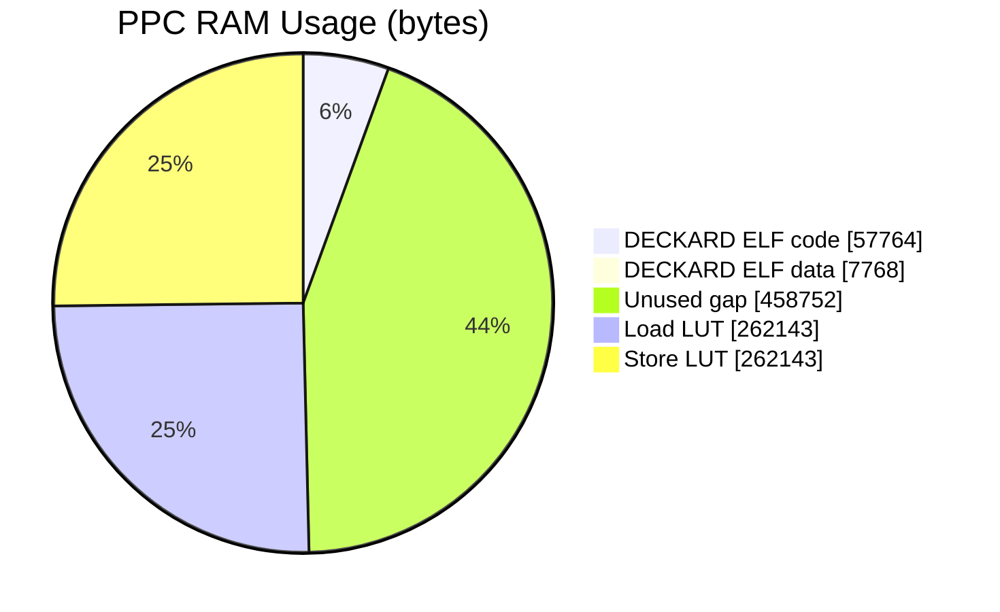
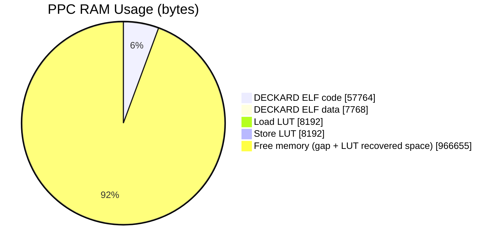

# Patch Information

Patch loading can be accomplished in multiple ways. Wisi's patch loader used  
in their dplibmod project copied the patch from EE memory to PPC-IOP mem and  
then loaded an IOP module to trigger patch execution. This approach is similar  
but does not require an IOP module to be loaded. It instead only requires an 
IOP reset.

Both of these methods were made under the assumption that an IOP module  
could not read or write into the `0xA00000` - `0xAFFFFF` address range. It's since  
been discovered that is not the case. An AIO IOP module patch loader would  
probably be superior to both of these methods.  

This patch loader copies the patch from EE mem to `0xA20000` PPC-IOP mem and then  
places a branch instruction to `0xA20000` in the PPC-IOP intr handler. After  
issuing an IOP reset this branch will be hit and PPC execution will divert to  
the patch code.

From there the patch will resize and relocate the LUTs to create a continuous  
region of free memory, approximately 966KB in size. Every entry in the LUTs  
corresponds to a 4 word span. Example: `0x1F808300`-`0x1F808310` = one entry in  
the table / one function will handle load or stores for `0x1F808300`-`0x1F808310`  
There are entries for the entire `0x1f801000` - `0x1f900fff` range. As a result  
a lot of space is unused/wasted in each LUT. Shrinking the load and store  
LUTs is accomplished by removing entries for `0x1f808600` - `0x1f900fff` and  
inserting a branch before a function pointer is read from the LUT. At this  
branch the address range is determined and the appropriate function is called  
(see `load_lut_handler` & `store_lut_handler` in [`patch.c`](https://github.com/israpps/PPC-Monitor/blob/main/patch/src/patch.c)).

## Before Patch:

|    Address Range     |     Function     |          Size          |
| -------------------- | ---------------- | ---------------------- |
| `A00000` - `A0E1A4`  | DECKARD ELF code | (`0xE1A4`) 57.764 KB   |
| `A0E1A8` - `A0FFFF`  | DECKARD ELF data | (`0x1E58`) 7.768 KB    |
| `A10000` - `A7FFFF`  | Unused           | (`0x70000`) 458.752 KB |
| `A80000` - `ABFFFF`  | Load LUT         | (`0x3FFFF`) 262.143 KB |
| `AC0000` - `AFFFFF`  | Store LUT        | (`0x3FFFF`) 262.143 KB |

  

    Graph
  

  

## After Patch:

|     Address Range     |     Function     |         Size          |
|-----------------------|------------------|-----------------------|
| `A00000` - `A0E1A4`   | DECKARD ELF code | (`0xE1A4`)  57.764 KB |
| `A0E1A8` - `A0FFFF`   | DECKARD ELF data | (`0x1E58`)  7.768 KB  |
| `A10000` - `A11FFF`   | Load LUT         | (`0x2000`)  8.192kb   |
| `A12000` - `A13FFF`   | Store LUT        | (`0x2000`)  8.192kb   |
| `A14000` - `AFFFFF`   | Unused           | (`0xEBFFF`) 966.655KB |

  

    Graph
  

  

Additionally, the patch starts PPC-Monitor a simple serial debugging tool that
runs in the background using the emulators event system.
